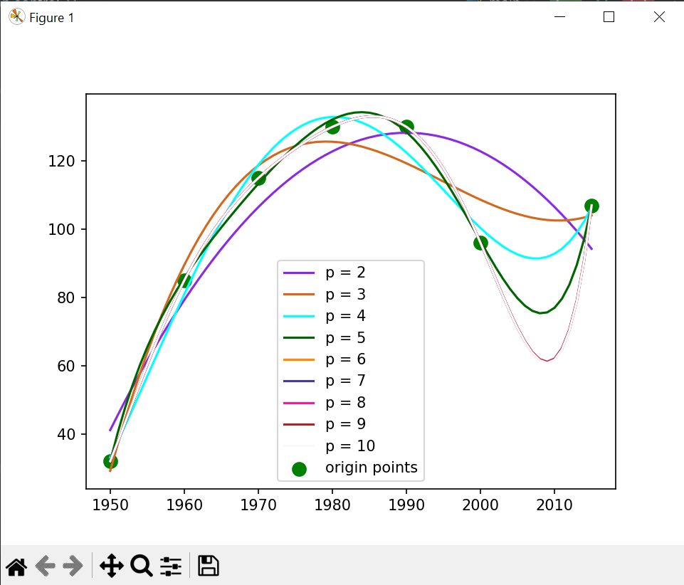

# Least square method

The method of least squares is a parameter estimation method in regression analysis based on minimizing the sum of the squares of the residuals (a residual being the difference between an observed value and the fitted value provided by a model) made in the results of each individual equation.  

Origin points:  

```txt
x = [1950, 1960, 1970, 1980, 1990, 2000, 2015]
y = [32, 85, 115, 130, 130, 96, 107]
```

Plot with polynomials of degree from 2 to 10:

  
